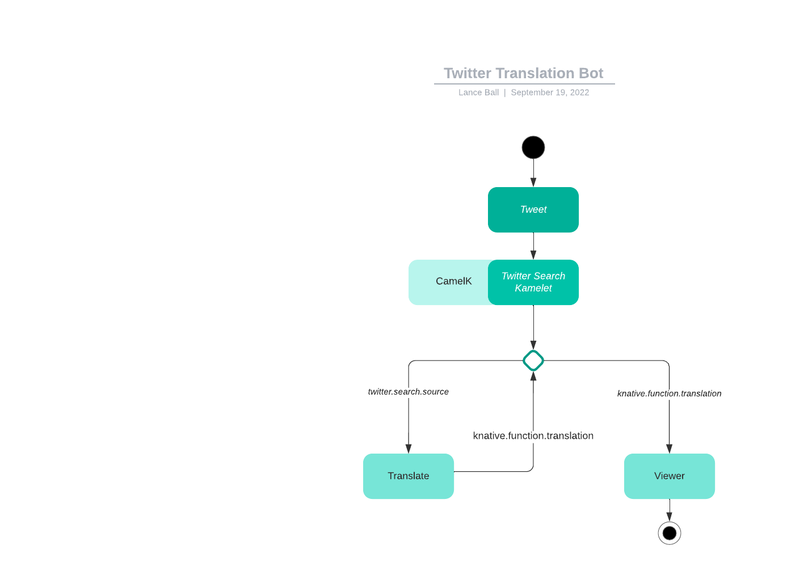

# KubeCon NA 2022 - Build a Twitter Translate Bot in 5 Minutes

This demo converts tweets into English using Camel-K and Knative.

It uses a Camel-K Kamelet to periodically search Twitter for [some value].
The Kamelet converts each tweet into a CloudEvent, sending it to the default Knative
Broker. A `translate` function receives these events via a `Trigger` between the
`Broker` and the function which filters for these types of events.

The `translate` function inspects the tweet language and if it's English, it simply
returns the tweet text as the `data` for a translation event. If it's not English,
the Google Translation API is used to convert the tweet text to English, and the
result is returned as the `data` in the translation event.

A `viewer` function is deployed to listen for translation events and display them in
the logs.

## Prerequisites
* You need to have a cluster with Knative installed
* You need to have CamelK https://camel.apache.org/camel-k/1.9.x/installation/installation.html installed

## Steps
* Install a broker with `kn broker create default`
* Update the Twitter credentials in [./resources/twitter-search-source-binding.yaml](resources/twitter-search-source-binding.yaml)
* Install the Kamelet with `kubectl apply -f resources/twitter-search-source-binding.yaml`
* Create a trigger with `kn trigger create twitter-trigger -s translate --filter type=twitter.search.source`
* Create a trigger with `kn trigger create translate-trigger -s viewer --filter type=knative.function.translation`
* Deploy the `translate` and `viewer` functions with `func deploy -p viewer` and `func deploy -p translate`.